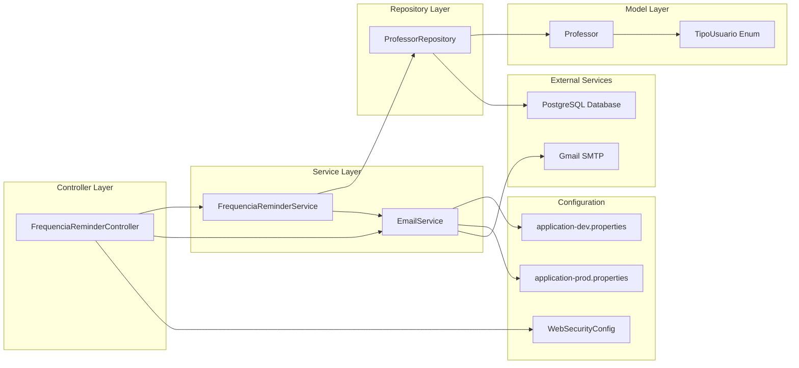
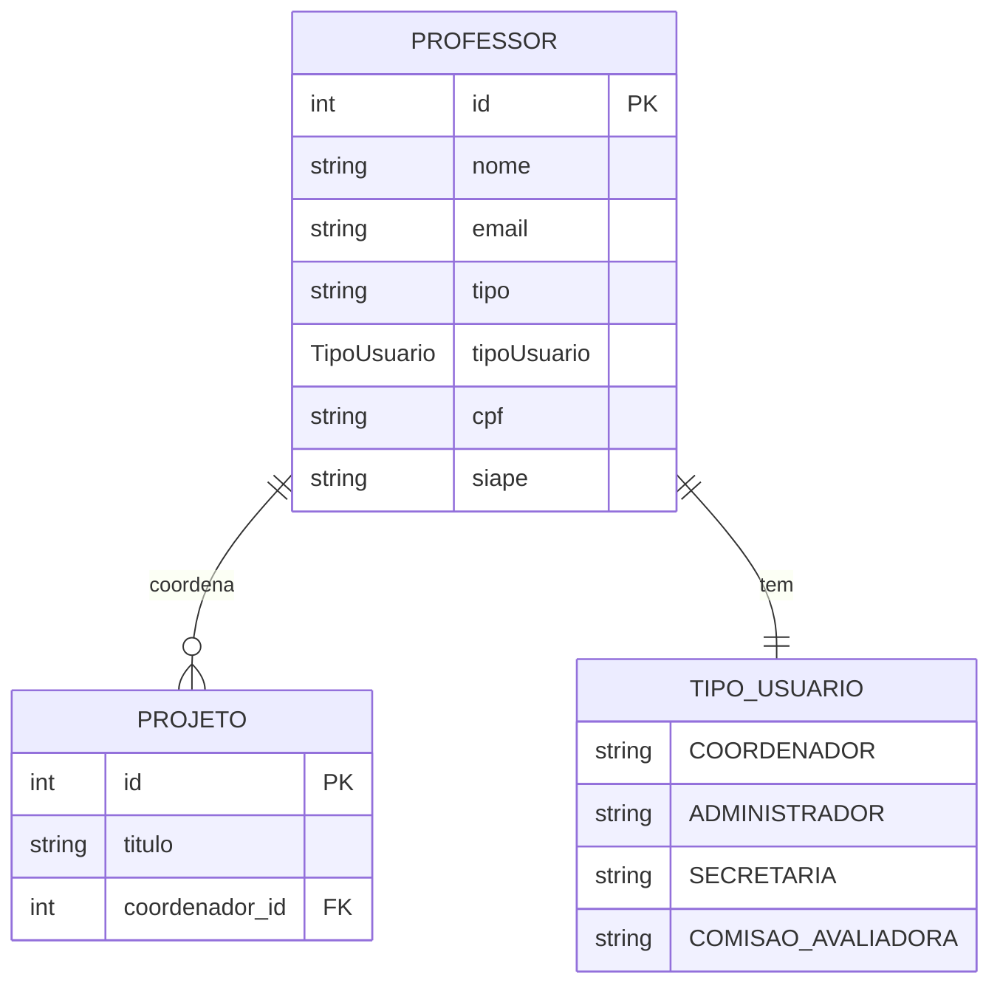
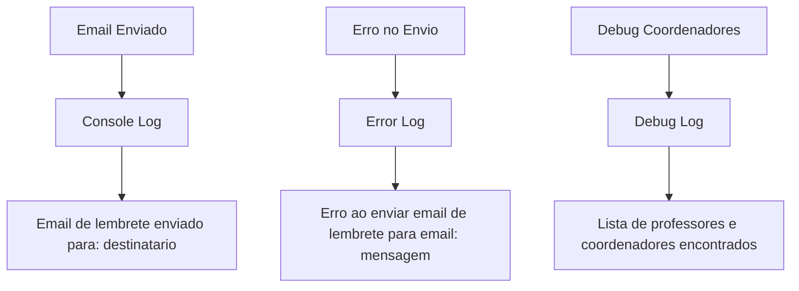

# Diagrama da Funcionalidade de Lembrete de Frequência

  

## Fluxo da Funcionalidade

  

```mermaid

graph TD

A[Cliente/Insomnia] -->|POST /api/frequencia-reminder/enviar| B[FrequenciaReminderController]

A -->|GET /api/frequencia-reminder/debug-coordenadores| C[Debug Coordenadores]

A -->|GET /api/frequencia-reminder/test-email| D[Teste Email]

B --> E[FrequenciaReminderService.enviarLembretesFrequencia]

C --> F[FrequenciaReminderService.debugCoordenadores]

D --> G[FrequenciaReminderService.testEmail]

E --> H[ProfessorRepository.findAllCoordenadores]

F --> I[ProfessorRepository.findAll]

F --> H

H -->|Query SQL| J[(Banco PostgreSQL)]

I -->|Query SQL| J

E --> K[EmailService.sendReminderEmail]

G --> K

K --> L{Verificar Modo Dev}

L -->|Dev Mode| M[Redirecionar para autenticacaoc@gmail.com]

L -->|Prod Mode| N[Enviar para email real do coordenador]

M --> O[Assunto: [DEV] Lembrete: Registro de Frequências - PROPAG]

N --> P[Assunto: Lembrete: Registro de Frequências - PROPAG]

O --> Q[Gmail SMTP]

P --> Q

Q --> R[Email Enviado]

E --> S[ResponseHandler - Relatório de Envio]

F --> T[ResponseHandler - Lista de Coordenadores]

G --> U[ResponseHandler - Confirmação de Teste]

S --> V[Resposta JSON com Total de Emails Enviados]

T --> W[Resposta JSON com Lista de Professores]

U --> X[Resposta JSON com Confirmação]

```

  

## Arquitetura dos Componentes

  



  

## Fluxo de Configuração por Ambiente

  

```mermaid

graph TD

A[Aplicação Inicia] --> B{Profile Ativo?}

B -->|dev| C[application-dev.properties]

B -->|prod| D[application-prod.properties]

C --> E[app.email.dev-redirect=autenticacaoc@gmail.com]

D --> F[app.email.dev-redirect=]

E --> G[EmailService detecta modo DEV]

F --> H[EmailService detecta modo PROD]

G --> I[Redireciona todos os emails para autenticacaoc@gmail.com]

H --> J[Envia emails para destinatários reais]

I --> K[Adiciona prefixo [DEV] no assunto]

J --> L[Assunto normal sem prefixo]

```

  

## Template do Email

  

```mermaid

graph TD

A[EmailService.sendReminderEmail] --> B{Modo Dev?}

B -->|Sim| C[Assunto: [DEV] Lembrete: Registro de Frequências - PROPAG]

B -->|Não| D[Assunto: Lembrete: Registro de Frequências - PROPAG]

C --> E[Destinatário: autenticacaoc@gmail.com]

D --> F[Destinatário: email real do coordenador]

E --> G[Corpo do Email]

F --> G

G --> H["Prezado(a) Coordenador(a) {nome},\n\nEste é um lembrete automático do sistema PROPAG..."]

H --> I[Instruções passo-a-passo para registrar frequências]

I --> J[Informações de contato e assinatura]

```

  

## Estrutura de Dados

  



  

## Endpoints Disponíveis

  

| Método | Endpoint | Descrição | Autenticação |

|--------|----------|-----------|--------------|

| POST | `/api/frequencia-reminder/enviar` | Envia lembretes para todos os coordenadores | Não |

| GET | `/api/frequencia-reminder/debug-coordenadores` | Lista todos os professores e coordenadores | Não |

| GET | `/api/frequencia-reminder/test-email` | Testa envio de email simples | Não |

  

## Configurações por Ambiente

  

### Desenvolvimento (application-dev.properties)

- `app.email.dev-redirect=autenticacaoc@gmail.com`

- `server.port=8090`

- `app.frontend.url=http://localhost:4200`

  

### Produção (application-prod.properties)

- `app.email.dev-redirect=` (vazio)

- `server.port=8090`

- `app.frontend.url=https://sispropag.ufc.br`

  

## Logs e Monitoramento

  

