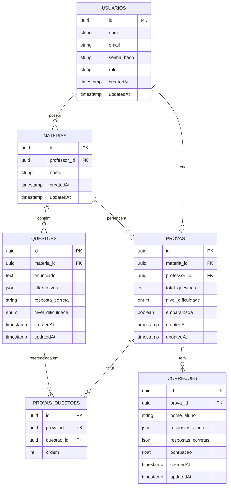
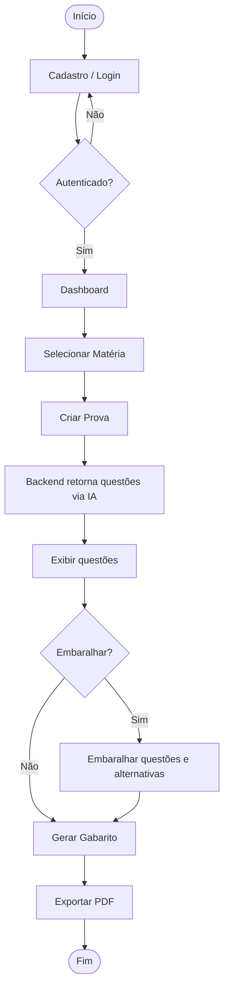

**Versão:** 1.0
**Data:** 2026-04-10
**Status:** Em revisão

---
## 1. Visão Geral

O **Probator-IA** é um sistema de geração e gerenciamento de provas escolares assistido por inteligência artificial. A plataforma permite que professores criem provas de múltipla escolha a partir de um banco de questões gerado por IA, com suporte a embaralhamento, geração de gabarito e exportação em PDF.

---
## 2. Estrutura do Banco de Dados

  



---
## 3. Requisitos Funcionais
### 3.1 Autenticação e Cadastro

| ID    | Requisito                                                                                    |
| ----- | -------------------------------------------------------------------------------------------- |
| RF-01 | O sistema deve disponibilizar tela de login com e-mail e senha.                              |
| RF-02 | O sistema deve disponibilizar tela de cadastro com nome, matéria, e-mail e senha.            |
| RF-03 | O cadastro de novos usuários é restrito ao perfil de **professor**.                          |
| RF-04 | O sistema deve autenticar o professor e redirecioná-lo ao dashboard após login bem-sucedido. |

### 3.2 Dashboard e Matérias

| ID    | Requisito                                                                               |
| ----- | --------------------------------------------------------------------------------------- |
| RF-05 | O dashboard deve exibir as matérias vinculadas ao professor autenticado.                |
| RF-06 | Ao selecionar uma matéria, o professor deve visualizar a opção de criar uma nova prova. |
### 3.3 Geração de Provas

| ID    | Requisito                                                                                                           |
| ----- | ------------------------------------------------------------------------------------------------------------------- |
| RF-07 | O sistema deve gerar questões de múltipla escolha por meio de IA.                                                   |
| RF-08 | O professor pode definir o número de questões da prova (ex.: 10 questões).                                          |
| RF-09 | O professor pode definir o nível de dificuldade da prova: Fácil, Médio ou Difícil.                                  |
| RF-10 | Ao solicitar a criação de uma prova, o frontend realiza requisição ao backend, que retorna as questões disponíveis. |
| RF-11 | As questões retornadas devem ser exibidas em uma página dedicada.                                                   |

### 3.4 Embaralhamento

| ID | Requisito |
|----|-----------|
| RF-12 | O professor pode embaralhar as questões selecionadas por meio de um botão dedicado. |
| RF-13 | O embaralhamento deve reorganizar a ordem das questões e das alternativas, mantendo a resposta correta consistente. |

### 3.5 Gabarito e Exportação

| ID | Requisito |
|----|-----------|
| RF-14 | O sistema deve permitir a geração de um gabarito completo, com as respostas corretas identificadas (não apenas as alternativas). |
| RF-15 | O professor pode exportar a prova e o gabarito em formato PDF. |
| RF-16 | O professor pode fazer o download do PDF ou enviá-lo para impressão diretamente pelo sistema. |

---
## 4. Cenários de Uso

### Cenário 1 — Criação de Prova com Embaralhamento e Gabarito

**Ator:** Professor
**Pré-condição:** Professor cadastrado e autenticado no sistema.

```

1. Professor acessa o dashboard e visualiza suas matérias.

2. Professor clica em "Geografia".

3. O sistema exibe a opção "Criar Prova".

4. Professor clica em "Criar Prova".

5. O frontend envia requisição ao backend.

6. O backend retorna as questões já geradas.

7. O frontend exibe as questões na tela.

8. Professor clica em "Embaralhar".

9. O sistema reorganiza a ordem das questões e das alternativas,

preservando as respostas corretas.

10. Professor clica em "Gerar Gabarito".

11. O sistema gera o gabarito com as respostas identificadas.

12. Professor clica em "Imprimir / Baixar PDF".

13. O sistema exporta a prova e o gabarito em PDF,

disponibilizando download e opção de impressão.

```

**Resultado esperado:** Professor obtém PDF da prova embaralhada e do respectivo gabarito.

---
### Cenário 2 — Criação de Prova sem Embaralhamento

**Ator:** Professor
**Pré-condição:** Professor cadastrado e autenticado no sistema.

```

1. Professor acessa o dashboard e visualiza suas matérias.

2. Professor clica em "Geografia".

3. O sistema exibe a opção "Criar Prova".

4. Professor clica em "Criar Prova".

5. O frontend envia requisição ao backend.

6. O backend retorna as questões já geradas.

7. O frontend exibe as questões na tela.

8. Professor clica em "Gerar Gabarito".

9. O sistema gera o gabarito com as respostas identificadas.

10. Professor clica em "Imprimir / Baixar PDF".

11. O sistema exporta a prova e o gabarito em PDF,

disponibilizando download e opção de impressão.

```

**Resultado esperado:** Professor obtém PDF da prova na ordem original e do respectivo gabarito.

---
## 5. Requisitos Não Funcionais (Sugeridos)

| ID | Requisito |
|----|-----------|
| RNF-01 | As senhas devem ser armazenadas com hash seguro (ex.: bcrypt). |
| RNF-02 | O sistema deve responder à geração de questões em no máximo 10 segundos. |
| RNF-03 | O PDF gerado deve ser fiel ao layout exibido no frontend. |
| RNF-04 | O sistema deve ser responsivo e acessível via navegador web. |
| RNF-05 | As rotas de criação e gerenciamento de provas devem ser protegidas por autenticação. |

---
## 6. Fluxo Simplificado do Sistema

  



  

## 7. Rotas do Sistema

### `POST /auth/register`

**Payload (Requisição):**

```json

{

"nome": "Professor",

"email": "[EMAIL_ADDRESS]",

"senha": "[PASSWORD]",

"materia": "Geografia"

}

```

### `POST /auth/login`

**Payload (Requisição):**

```json

{

"email": "[EMAIL_ADDRESS]",

"senha": "[PASSWORD]"

}

```

### `GET /dashboard`

**Resposta de Sucesso:**

```json

{

"status": "success",

	"data": {
	
	"id": "uuid",
	
	"nome": "Professor",
	
	"email": "[EMAIL_ADDRESS]",
	
	"materia": "Geografia"
	
	}

}

```

### `GET /dashboard/materia/:id`

**Resposta de Sucesso:**

```json

{

"id": "uuid",

"nome": "Geografia",

"questoes": [

	{
	
	"id": "uuid",
	
	"enunciado": "Enunciado da questão",
	
	"alternativas": [
	
	{
	
	"id": "uuid",
	
	"texto": "Alternativa 1"
	
	},
	
	{
	
	"id": "uuid",
	
	"texto": "Alternativa 2"
	
	},
	
	{
	
	"id": "uuid",
	
	"texto": "Alternativa 3"
	
},

	{
	
	"id": "uuid",
	
	"texto": "Alternativa 4"
	
	}
	
	],
	
	"resposta_correta": "uuid"
	
	}
	
	]

}

```

  

### `POST /materia/criar-prova`

**Payload (Requisição):**

```json

{

"numero_questoes": 10,

"dificuldade": "Fácil",

"materia": "Geografia"

}

```

  

### `POST /embaralhar`

**Payload (Requisição):**

```json

{

"questoes": [

{

"id": "uuid",

"alternativas": [

{

"id": "uuid",

"texto": "Alternativa 1"

},

{

"id": "uuid",

"texto": "Alternativa 2"

},

{

"id": "uuid",

"texto": "Alternativa 3"

},

{

"id": "uuid",

"texto": "Alternativa 4"

}

],

"resposta_correta": "uuid"

}

]

}

```

  

### `GET /gabarito`

**Resposta de Sucesso:**

```json

{

"questoes": [

{

"id": "uuid",

"enunciado": "Enunciado da questão",

"alternativas": [

{

"id": "uuid",

"texto": "Alternativa 1"

},

{

"id": "uuid",

"texto": "Alternativa 2"

},

{

"id": "uuid",

"texto": "Alternativa 3"

},

{

"id": "uuid",

"texto": "Alternativa 4"

}

],

"resposta_correta": "uuid"

}

]

}

```

  

### `GET /pdf`

**Resposta de Sucesso:**

```json

{

"pdf": "base64"

}

```

  

## Referencias de Documentação

  

[NotebookLM](https://docs.cloud.google.com/gemini/enterprise/notebooklm-enterprise/docs/api-notebooks?hl=pt-br)

  

[NotebookLM Não-Oficial](https://github.com/teng-lin/notebooklm-py)

  

[NotebookLM Não-Oficial V2](https://github.com/gnh1201/notebooklm-rest-api)